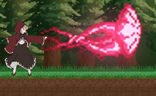

# team14
# ゲームの説明
:基本操作
←キー、→キーを使って左右に移動！
spaceキー、↑キーでジャンプ！

aキーで能力を使用!

:アイテム
ファイヤーローズ

ファイヤーローズを拾うことでaキーで敵にダメージを与えられるぞ！

aキーを長押しすると、、、
・一回チャージ

ノックバックがついてダメージが上がるぞ！

もっとためてみると...

さらにダメージが高くなる！！

能力を駆使しながら右側に進んでいくと見えてくるゴールを目指そう！！

## 主人公キャラの要件定義
デザイン案１- 人型（棒人間、SDキャラなど）
デザイン案２- デフォルメキャラ（カービィみたいな単純な球体等のようなデザイン）
デザイン案３- クリーチャー型キャラ(ドラゴン、アンデッドのようなモンスターなど)
ゲームオーバー要件
案１- ヒットポイントタイプ
敵キャラやステージギミックなどとの接触回数で体力を管理する方式
接触可能回数の残りによって主人公の外見等が変化（今のところこっちが有力候補）
案２- ライフポイントタイプ
主人公キャラに固有のライフポイントを設定し、０になったらゲームオーバーの方式
こっちの方式ならライフポイントの増減に影響するアイテムなどの追加も考慮
その他設定
アイテムの獲得状況やその他条件の達成で固有の能力を獲得

ソフトウェア工学Ⅱのためのリポジトリ
主担当者:山口哲平
【敵キャラの概要】
・オオカミ（1回触れたら、主人公キャラが１段階弱くなる。上から踏むと倒すことができる）
・フランケンシュタイン（１回触れたら、主人公キャラが１段階弱くなる。上から踏むと倒すことができる）
・蜘蛛（１回触れたら主人公キャラが１段階弱くなる）
・空飛ぶミイラ（１回触れたら主人公キャラが１段階弱くなる、空から近づいてくる）
・歯車（１回触れたら主人公キャラが１段階弱くなる）
・ボスパンダ（１回触れたらその段階で死ぬ）

【アイテム】
・ファイヤーローズ（主人公キャラからファイヤーを吹き出すことができるようになる）
・赤リンゴ（主人公キャラが１段階大きく強くなる）
・毒リンゴ（主人公キャラが触れたとたん死ぬ）
・コイン（コインを100枚集めたら、主人公が1段階大きく強くなる）
島津太一
yamaguchiteppei
>>>>>>> 6a2773f (自分の名前を追加しました。)

c87a0ef (新しい文章です)
横スクリーン型移動ゲーム（マリオみたいな）
スーパーマリオのような横に移動しながらマップにあるゴールを目指すゲームアプリ

ルール
十字キーを入力することで入力した方向に動いていく
アイテムを拾うことで敵キャラに触れても耐えられる
敵キャラに触れたらゲームオーバー
マップに空いてある穴に落ちたらゲームオーバー
マップを進んでいくとあるゴールに触れればゲームクリア

マップの要件定義

マップの見た目は主にスーパーマリオの1－1参照。
機能としてはマップの地面をキャラクターが歩けること
一つ一つの障害物に当たり判定があること

マップの各所に様々なイベント（トラップ）を加え、単調な底スクリーンゲームにしないこと
>>>>>>> dc713db6cc04b6c6834a789767286a8afcec3568

マップの各所に様々なイベント（トラップ）を加え、単調な横スクリーンゲームにしないこと
>>>>>>> 2bec1145f6c756c2e6868fed8d54846265689569
>>>>>>> 819c9cc62c44de91a03039eee1bdec299159ed99
